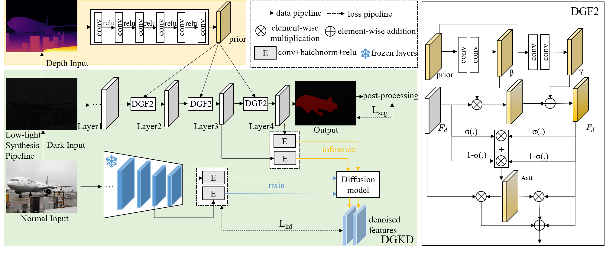
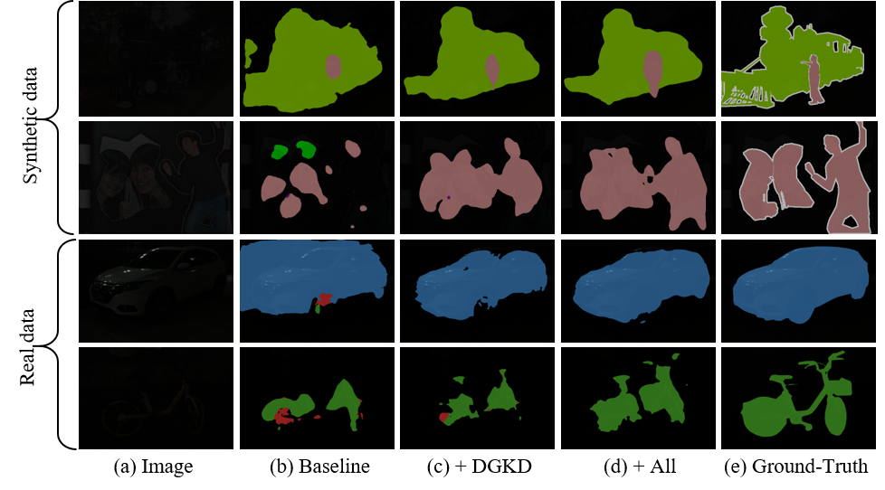

# Diffusion-Guided Knowledge Distillation for Weakly-Supervised Low-Light Semantic Segmentation
This repository contains the official PyTorch implementation of the following paper:
#### [Diffusion-Guided Knowledge Distillation for Weakly-Supervised Low-Light Semantic Segmentation]()
Chunyan Wang, Dong Zhang, Jinhui Tang

## Abstract 
<p align="justify">
Weakly-supervised semantic segmentation aims to assign category labels to each pixel using weak annotations, significantly reducing manual annotation costs. Although existing methods have achieved remarkable progress in well-lit scenarios, their performance significantly degrades in low-light environments due to two fundamental limitations: severe image quality degradation (e.g., low contrast, noise, and color distortion) and the inherent constraints of weak supervision. These factors collectively lead to unreliable class activation maps and semantically ambiguous pseudo-labels, ultimately compromising the model's ability to learn discriminative feature representations. To address these problems, we propose Diffusion-Guided Knowledge Distillation for Weakly-Supervised Low-light Semantic Segmentation (DGKD-WLSS), a novel framework that synergistically combines Diffusion-Guided Knowledge Distillation (DGKD) with Depth-Guided Feature Fusion (DGF2). DGKD aligns normal-light and low-light features via diffusion-based denoising and knowledge distillation, while DGF2 integrates depth maps as illumination-invariant geometric priors to enhance structural feature learning. Extensive experiments demonstrate the effectiveness of DGKD-WLSS, which achieves state-of-the-art performance in weakly supervised semantic segmentation tasks under low-light conditions. 

## The overall architecture
<br> 

## Qualitative results
<br>


## Requirements
- Python=3.8
- pytorch=1.13.1
- torchvision=0.14.1
- CUDA=11.7
- others (requirements.txt)

## Preparation

1. Download [darkened PASCAL VOC 2012](https://drive.google.com/file/d/1EMVeWPgkiToG_HWBy7o0iG_5FF1HLbvk/view?usp=drive_link) and corresponding depth images [vis_depth_voc](https://drive.google.com/file/d/1l6MbmJAwk5SYWdxJDzCuQoR8FscoxgAS/view?usp=drive_link) datasets, then put them in ./dataset/.
2. Download [LIS:RGB-dark and RGB-normal](https://drive.google.com/drive/folders/1KpC82G_H1CI35lmnB2LYr9aK3FQcahAC) and corresponding depth images [vis_depth_lis](https://drive.google.com/file/d/1vw--djckEz0wLdVqYQZ8cKtbfpPG4EE3/view?usp=drive_link) datasets, then put them in ./dataset/LIS/.
3. Download pre-trained models.
   Download the pretrained weight: [pretrained_ckpts](https://drive.google.com/drive/folders/1v2hBOX5DzxNUx4QxAdR3dK3uw66ZOOUv?usp=drive_link) and place them into 
   `./pretrained_ckpts/`.
4. Revise the 'cls_labels_dict' and 'img_path' in './dataset/datasets_lis.py' (in the line 54,85,93,100,108) as your file path.
   
 

## Model Zoo
   Download the trained models and category performance below.
   | Backbone | Val| weight link |
|:---:|:---:|---:|
| WideResNet38 |57.1 (voc)| [dgkd_wlss_voc12_best_model.pth](https://drive.google.com/file/d/1PkUkGdwviFajLyI1FOE_ePbeXy-rZuCP/view?usp=drive_link) |
| WideResNet38 |54.1 (lis)| [dgkd_wlss_LIS_best_model.pth](https://drive.google.com/file/d/1aK_xXLMxDyT9aVL05CtsVPS2Sd-Jkhkr/view?usp=drive_link) |
| WideResNet38 |46.3 (train on voc test on LIS)| [dgkd_wlss_VOC_LIS_best_model.pth](https://drive.google.com/file/d/1S4BUghHUwGrh2H6Eygb1ZaNCA_xTvRJU/view?usp=drive_link) |

## Usage

### Train on darkened VOC2012.
1. Training:
   ```
   python train_kd_wsss.py  \
     --teacher_model ssss \
     --student_model ssss \
     --data ./dataset/darkened_VOC2012 \
     --train_list ./dataset/voc12/train_aug.txt \
     --val_list ./dataset/voc12/train.txt \
     --teacher_pretrained ./ckpts/model_enc_e020Xs0.928.pth \
     --student_pretrained_base  ./ckpts/ilsvrc-cls_rna-a1_cls1000_ep-0001.params
   ```

2. Inference.

   Download the trained model from https://drive.google.com/file/d/1PkUkGdwviFajLyI1FOE_ePbeXy-rZuCP/view?usp=drive_link, set ```--pretrained``` and then run:
   ```
   python test_wsss.py \
     --data_list ./dataset/voc12/val.txt \ 
     --pretrained $trained_model \
     --save_dir ./runs/logs/

### Train on dark LIS.
1. Training:
   ```
   python train_kd_wsss_lis.py  \
     --teacher_model ssss \
     --student_model ssss \
     --data ./dataset/LIS \
     --train_list ./dataset/LIS/train_dark.txt \
     --val_list ./dataset/LIS/test_dark.txt \
     --teacher_pretrained ./ckpts/model_lis_normal.pth \
     --student_pretrained_base  ./ckpts/ilsvrc-cls_rna-a1_cls1000_ep-0001.params
   ```

2. Inference.

   Download the trained model from https://drive.google.com/file/d/1aK_xXLMxDyT9aVL05CtsVPS2Sd-Jkhkr/view?usp=drive_link, set ```--pretrained``` and then run:
   ```
   python test_wsss_lis.py \
     --data_list ./dataset/LIS/test_dark.txt \ 
     --pretrained $trained_model \
     --save_dir ./runs/logs/

### Train on darkened VOC2012 and test on dark LIS.
1. Training:
   ```
   python train_on_voc_test_lis_wsss.py  \
     --teacher_model ssss \
     --student_model ssss \
     --data ./dataset/LIS \
     --train_list ./dataset/LIS/voc_train_8_classes_train.txt \
     --val_list ./dataset/LIS/voc_train_8_classes_val.txt \
     --teacher_pretrained ./ckpts/model_voc_8_normal.pth \
     --student_pretrained_base  ./ckpts/ilsvrc-cls_rna-a1_cls1000_ep-0001.params
   ```

2. Inference.

   Download the trained model from https://drive.google.com/file/d/1S4BUghHUwGrh2H6Eygb1ZaNCA_xTvRJU/view?usp=drive_link, set ```--pretrained``` and then run:
   ```
   python test_wsss_lis.py \
     --data_list ./dataset/LIS/test_dark.txt \ 
     --pretrained $trained_model \
     --save_dir ./runs/logs/


## Acknowledgements
We sincerely thank [Tao Huang](https://proceedings.neurips.cc/paper_files/paper/2023/file/cdddf13f06182063c4dbde8cbd5a5c21-Paper-Conference.pdf) for his great work in  NeurIPS 2023. We borrow codes heavly from his repositories [diffkd](https://github.com/hunto/DiffKD).


